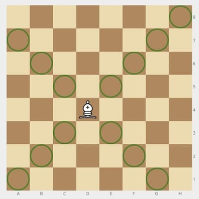
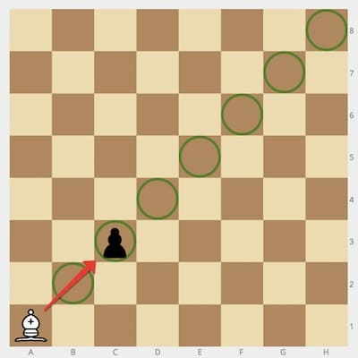
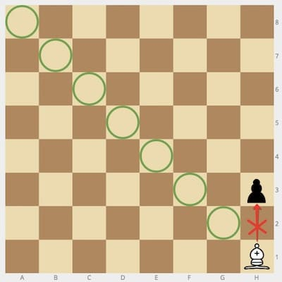

# Challenge
Given the positions of a white `bishop` and a black `pawn` on the standard chess board, determine whether the bishop can capture the pawn in one move.

The bishop has no restrictions in distance for each move, but is limited to diagonal movement. Check out the example below to see how it can move:

# Example

- For `bishop = "a1"` and `pawn = "c3"`, the output should be `solution(bishop, pawn) = true`.

	

- For `bishop = "h1"` and `pawn = "h3"`, the output should be `solution(bishop, pawn) = false`.

	
