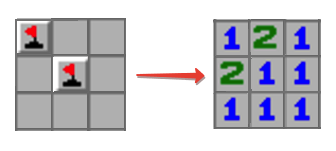

# Challenge
In the popular **Minesweeper** game you have a board with some mines and those cells that don't contain a mine have a number in it that indicates the total number of mines in the neighboring cells. Starting off with some arrangement of mines we want to create a **Minesweeper** game setup.

# Example
For

~~~ts
matrix = [
	[true, false, false],
	[false, true, false],
	[false, false, false],
]
~~~

the output should be

~~~ts
solution(matrix) = [
	[1, 2, 1],
	[2, 1, 1],
	[1, 1, 1],
]
~~~

Check out the image below for better understanding:

